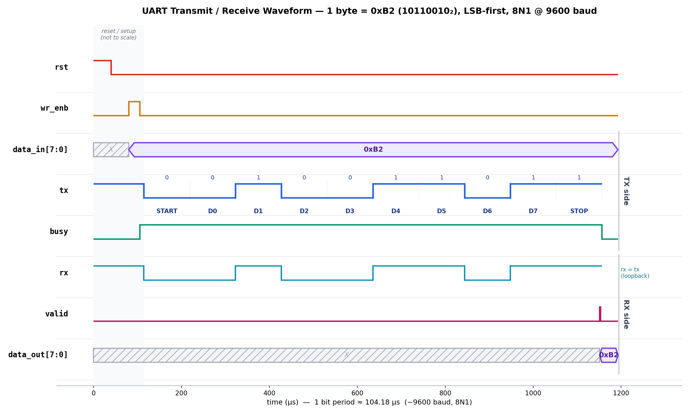

# UART Transmitter & Receiver (Verilog)

A from-scratch, register-transfer-level implementation of a UART (Universal Asynchronous Receiver/Transmitter) in Verilog — an 8-bit, no-parity, 1-stop-bit (8N1) serial link with a configurable baud-rate generator, verified in simulation with a self-checking testbench.

---

## 1. Overview

UART is the simplest form of asynchronous serial communication: two devices exchange bytes over a single wire in each direction, with no shared clock. Timing is instead recovered from the data stream itself using a known baud rate.

This project implements both halves of that link:

| Module      | Role                                                              |
|-------------|--------------------------------------------------------------------|
| `uart_tx`   | Serializes an 8-bit parallel word into a UART frame                |
| `uart_rx`   | Deserializes an incoming UART frame back into an 8-bit parallel word |
| `baud_gen`  | Generates the tick enables (`tx_enb` / `rx_enb`) that pace the TX and RX state machines to the target baud rate |
| `tx_module` / `rx_module` | Wrap `uart_tx`/`uart_rx` together with their own `baud_gen` instance |

The design was simulated with **Icarus Verilog**, and the waveform below was generated directly from the simulation's VCD dump.

---

## 2. UART Frame Theory

A UART frame carries one byte, framed by a start and stop bit:

```
idle ──▶ START ▶ D0 ▶ D1 ▶ D2 ▶ D3 ▶ D4 ▶ D5 ▶ D6 ▶ D7 ▶ STOP ──▶ idle
 (1)      (0)                                              (1)
```

- **Idle line state** is logic `1`.
- **Start bit** — the line is pulled to `0` for one bit period. This falling edge is what tells the receiver a frame has begun and lets it synchronize its internal sample clock, even though there's no shared clock between TX and RX.
- **Data bits** — 8 bits, sent **LSB-first**.
- **Stop bit** — the line returns to `1` for one bit period, guaranteeing at least one bit of idle time before the next frame and giving the receiver a point to confirm the frame ended cleanly.
- **Baud rate** defines the bit period (`1 / baud`). Both ends must agree on it in advance since there's no clock line to derive it from — this implementation targets **9600 baud** (≈104.17 µs/bit).

Because there's no parity bit here, this is a strict **8N1** format (8 data bits, No parity, 1 stop bit).

---

## 3. How It Works

### Transmitter (`uart_tx`)
A 4-state FSM (`idle → start → data → stop`) driven by the tick enable from `baud_gen`:
1. **idle** — `tx` held high, waiting for `wr_enb`.
2. On `wr_enb`, the input byte is latched and `busy` is asserted; the FSM moves to **start**, driving `tx` low for one bit period.
3. **data** — an internal 3-bit `index` counter shifts out `data[index]` once per baud tick, LSB first, over 8 bit periods.
4. **stop** — `tx` is driven high for one bit period, `busy` deasserts, and the FSM returns to **idle**.

### Receiver (`uart_rx`)
Mirrors the transmitter with its own `idle → start → data → stop` FSM:
1. **idle** — watches the `rx` line for the falling edge that marks a start bit.
2. **start** — waits out the start-bit period to align sampling to the middle of each following bit.
3. **data** — samples `rx` once per bit period for 8 bits, shifting them into an internal register (LSB first).
4. **stop** — checks for the expected high stop bit, then presents the byte on `data_out` and pulses `data_valid` for one clock cycle.

### Baud Generator (`baud_gen`)
A free-running counter clocked by the system clock that produces a single-cycle tick enable every `(clk_freq / baud_rate)` clocks — this tick is what advances both the TX and RX state machines at the correct rate.

---

## 4. Simulation Waveform

The waveform below was reconstructed directly from `uart.vcd` (Icarus Verilog dump) and shows one complete transmit → receive cycle of the byte **`0xB2`** (`1011_0010`, LSB-first) at 9600 baud:



**What to look for:**
- `wr_enb` pulses once → `data_in` is latched as `0xB2` and `busy` goes high.
- `tx` sends `START(0)`, then `D0..D7` = `0,1,0,0,1,1,0,1` (LSB-first), then `STOP(1)`.
- `rx` (looped back to `tx` in this testbench) receives the identical bit stream.
- `valid` pulses right after the stop bit, and `data_out` correctly reads back `0xB2` — confirming the TX → RX round trip is bit-accurate.

---

## 5. Repository Structure

```
.
├── src/
│   ├── uart_tx.v
│   ├── uart_rx.v
│   ├── baud_gen.v
│   ├── tx_module.v
│   └── rx_module.v
├── sim/
│   └── uart_tb.v
├── uart_waveform.png
└── README.md
```
*(adjust paths above to match your actual repo layout)*

---

## 6. Running the Simulation

```bash
# Compile
iverilog -o uart_sim sim/uart_tb.v src/*.v

# Run
vvp uart_sim

# View the generated waveform
gtkwave uart.vcd
```

---

## 7. Possible Extensions

- Parity bit support (even/odd)
- Configurable baud rate via a parameter or register
- FIFO buffering on TX/RX for back-to-back bytes
- FPGA-level integration test (physical UART loopback instead of simulated)

---

## License

MIT — feel free to use and modify.
